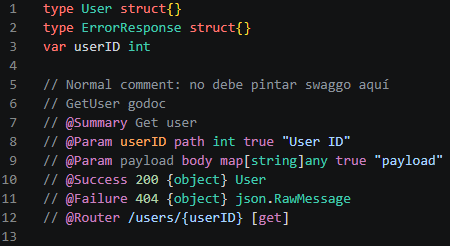

# Go Swaggo Highlight

Semantic highlighting for [Swaggo](https://github.com/swaggo/swag) annotations inside Go `godoc` comment blocks.

Swaggo comments live inside regular Go `//` comments, so most editors render them as plain gray text. This extension applies focused semantic coloring to routes, parameter names, types, HTTP methods, and response models — making your API documentation easier to read and navigate without touching anything outside `godoc` blocks.

## Features

**Swaggo annotations** — `@Summary`, `@Description`, `@Tags`, `@Accept`, `@Produce`, `@Param`, `@Success`, `@Failure`, `@Router`, and more are each highlighted distinctly.

**Go types** — primitives (`string`, `int`, `bool`, `float64`, `any`), composite types (`[]User`, `*User`, `map[string]any`), and qualified names (`json.RawMessage`) are colored according to their kind.

**HTTP methods** — `[get]`, `[post]`, `[put]`, `[patch]`, `[delete]` inside `@Router` lines stand out at a glance.

**Routes and path parameters** — `/users/{id}` fragments and `{id}` placeholders are highlighted separately.

**Literal values** — numbers, booleans, and quoted strings inside Swaggo lines get their own color.

**Symbol-aware resolution** — type names like `User` or `ErrorResponse` are matched against real declarations in your project using document symbols, workspace symbols, and local file parsing, so they highlight as actual Go types rather than plain identifiers.

## Example

Highlighting activates only inside `godoc` blocks — comments outside them are left untouched.

## Requirements

For the best type resolution across the whole project:

- Install the official [Go extension for VS Code](https://marketplace.visualstudio.com/items?itemName=golang.Go)
- Make sure `gopls` is running correctly
- Open the project root folder, not an isolated file

The extension works without `gopls` using local file analysis, but workspace-wide symbol resolution requires it.

## Known limitations

- Only `//` line comments are supported; block comments (`/* */`) are not.
- Complex generic or multiline type expressions may not highlight perfectly in all cases.
- Workspace symbol resolution depends on the language server available in your setup.

## License

MIT
